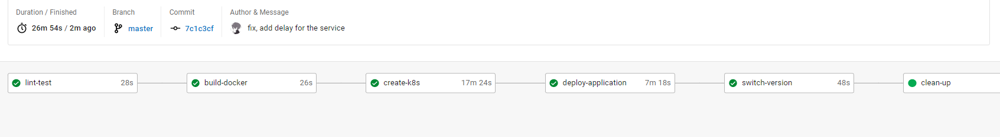
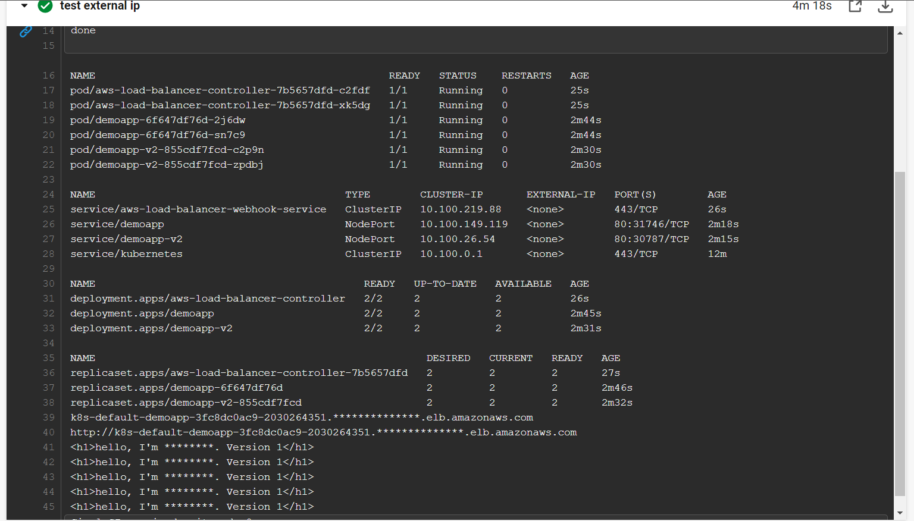

# capstone-cloud-devops-engineer

## About the project:
### Overview:
Create a pipeline to deploy a simple flask application to AWS EKS cluster. The application is a simple web application that returns a hello world message. The application is deployed using blue-green deployment. The pipeline is implemented using CircleCI and AWS EKS.

### About the blue-green deployment and circleci:
Blue-green deployment achieves zero downtime by deploying the new version of the application to a new environment (green) while the old version (blue) is still running. Once the new version is ready, the load balancer is switched to the new environment (green) and the old environment (blue) is terminated. In this project, I use AWS Load Balancer Controller to implement blue-green deployment, which help to control the ingress object to switch between 2 versions of the application.

I also use CircleCI AWS EKS orb to deploy the application to EKS cluster.

## Pipeline:

Lint (python code and dockerfile) -> Build docker image, push -> Deploy infrastructure -> Deploy application (k8s) -> Switch to new version -> Clean up 

## Note:
- Delete role "AmazonEKSLoadBalancerControllerRole" each run
- Modify security group of eks cluster to allow connect inbound in port 9433

## Screenshots:

Lint code

Test code

Docker image in Dockerhub

EKS cluster

Web version 1

Web version 2

